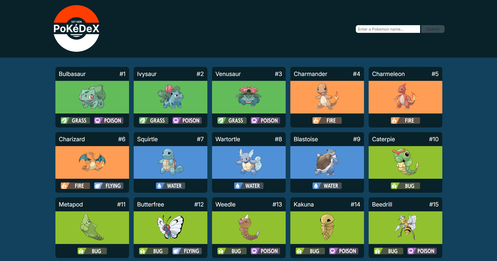
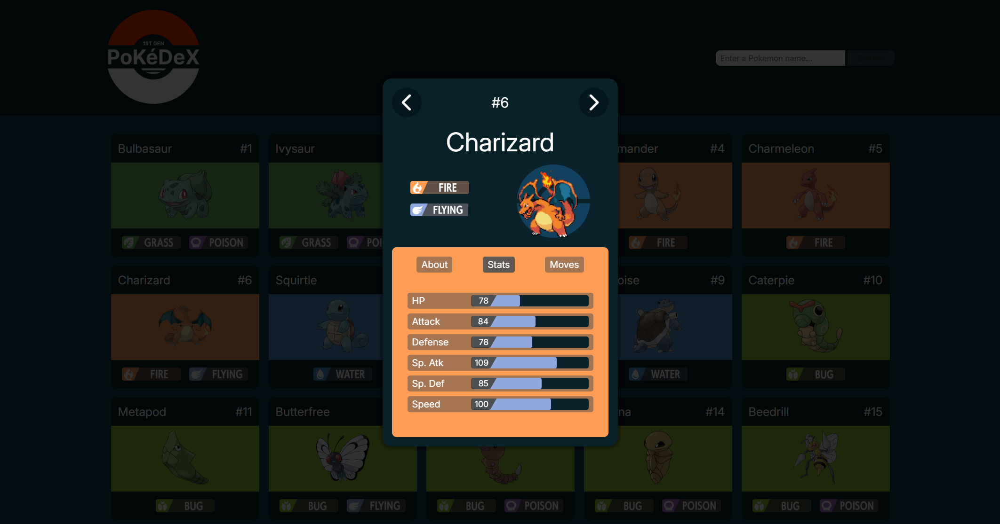

# Pokédex

A Pokédex web app featuring the first 151 Pokémon with search, pagination, and detailed views.

## Live-Demo
https://pokedex.simon-fuchs.net/

## Documentation
https://simcommit.github.io/pokedex/

## Screenshots

### Gallery

### Details

## Features
- Overview gallery with incremental loading  
  (21 Pokémon per batch, load more on demand)
- Search bar to filter Pokémon by name
- Clickable Pokémon cards opening a detail view
- Detailed Pokémon information:
  - Type(s)
  - Base stats with animated bar charts
  - Species, height, weight, abilities
  - Moves list
- Animated Pokémon sprite in the detail view
- Toggle between normal and shiny form via click on animated sprite
